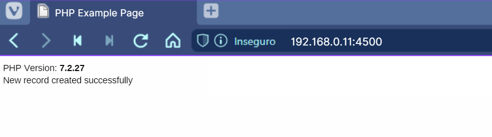
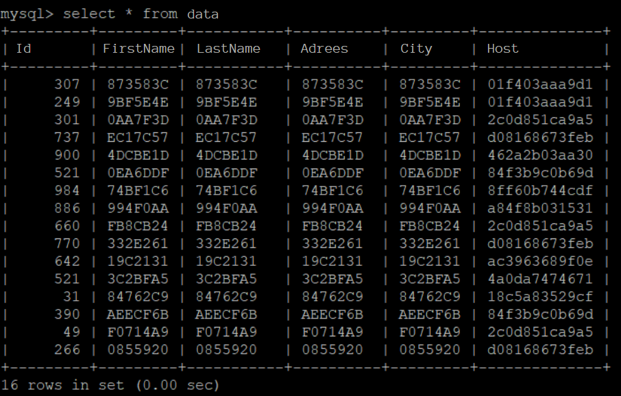

## Docker: Practical Use in Microservices


### VMs Configuration 

Implement 3 VMs on VirtualBox the Ubuntu Server with brigde -configured network boards to enter the same network as the host machine. To do this, after creating the first virtual machine, do two clones of it with the option to generate new MACs for the enabled network interfaces.
- Ubuntu1
- Ubuntu2
- Ubuntu3


Update the hostname of cloned VMs and after that restart the machines:

1. Update with the new hostname:

```
sudo nano /etc/hostname
```

2. Update where the old hostname appears:

```
sudo nano /etc/hosts
```


### Scripts IaC
4 iac scripts were created to automate the application deploy:

install-docker.sh -> It has instructions for installing docker at Ubuntu;

stand-alone-server.sh -> Deploy of stand-alone application, only 1 container running the web server, disabled cluster;

manager.sh -> Manager Node Setup and Cluster Docker Swarm initialization;

workers.sh -> Config Workers Nodes.

### Install Docker on 3 VMs using install-docker.sh script

Create the script:
```
nano install-docker.sh
```

Give execution permission:
```
chmod +x install-docker.sh
```

Run the script:

```
./install-docker.sh
```

### Execution in stand-alone Mode (centralized)

Run the following step only on the main server, which will be turned into a manager node in the Docker swarm cluster

Create the script:

```
nano stand-alone-service.sh
```

Give execution permission:
```
chmod +x stand-alone-service.sh
```

Run the script:

```
./stand-alone-service.sh
```

Enter the IP of your main server (first server) in the index.php file, to edit it you need to use the command:

```
nano /var/lib/docker/volumes/app/_data/index.php
```

Update the IP on line 16, for example:
> $servername = "192.168.0.11";

At this point you should already be able to test the application, access the IP of your main server in the browser. You should see the screen:


### Execution in cluster mode

**Prerequisites**

- Turn on the three ubuntu servers;
- Have Docker installed on all machines;
- Servers on the same local network. 

Note: check with the command
```
ip a
```

Configure IPs in Nginx proxy config file on main machine. 
Command to edit:
```
nano /var/lib/docker/volumes/app/_data/nginx.conf
```

Edit by putting the IPs corresponding to your servers. The proxy will "listen" on port 4500 when accessing through the cluster.

```
http {
   
    upstream all {
        server 192.168.0.11:80; # example ip ubuntu1
        server 192.168.0.12:80; # example ip ubuntu2
        server 192.168.0.13:80; # example ip ubuntu3
    }

    server {
         listen 4500;
         location / {
              proxy_pass http://all/;
         }
    }

}
```

Create the script:

```
manager.sh
```

Give execution permission:
```
chmod +x manager.sh
```

Run the script:
```
./manager.sh
```
In the middle of the execution it will appear that you need to execute a cluster command (Workers Nodes) on the cloned machines. The command will be indicated by Docker and starts with:

```
docker swarm join .... 
```

Run this command on the other two machines to add them to the cluster.

Go back to the main server and continue script execution by typing any key.
At the end a clustered service will be started with 10 containers distributed among the machines in the cluster, wait a few minutes until everything is ready.

Finally, you must run the workers.sh script only on machines defined as Workers Nodes, ubuntu2 and ubuntu3. To do this, perform the following steps.

Create the script:

```
workers.sh
```

Update the main server IP (Manager Node). Command to edit:

```
nano workers.sh
```

Edit with the corresponding IP of your Manager Node, 192.168.0.11 for example:
```
mount -o v3 192.168.0.11:/var/lib/docker/volumes/app/_data /var/lib/docker/volumes/app/_data
```

Give execution permission:
```
chmod +x workers.sh
```

Run the script:
```
./workers.sh
```

### Clustered service test
Access the web-server through the configured proxy. Open your browser and enter the IP of the main server, where the proxy is hosted, followed by port 4500, configured there in the nginx file.



And to confirm that the cluster is really working, we can access the database to confirm.

Access the database hosted on the main server using its IP and the name of the bank that was previously defined:

```
mysql -u root -p -h 192.168.0.11 mydata
```

Fill in the database password and when logging in type the command.
```
select * from data;
```

Note in the last column, the first 5 records were made with the application in stand-alone mode, so the hostname is repeated. In the following records, the insertions were made with the application in clustered mode, the proxy distributed the requests among the 3 servers, and Docker Swarm distributed even more, among the 10 containers created.

